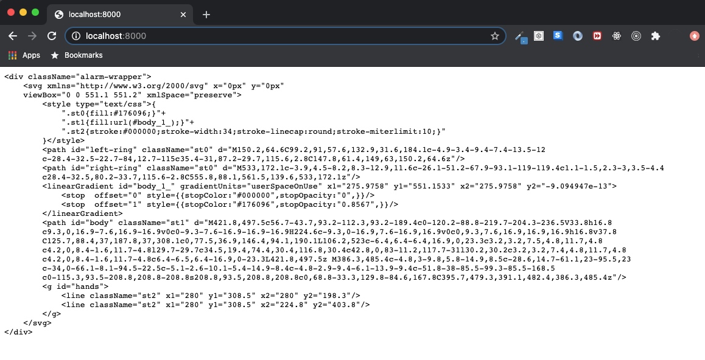
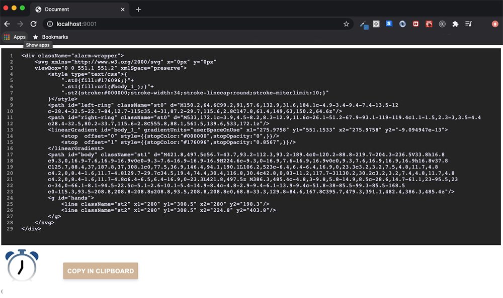

# SVG Converter

`convert-svg-react` was started because I work with a lot of web animations, and ran into a wall when trying to use inline SVG (XML) with ReactJS. React would complain everywhere, almost every SVG 
attribute had to be changed, even some of the structure of the code. Most SVG files can be lengthy and to go through all the code replace everything by hand can take a long time. So this does it 
for you in so many different ways. You can take your `Adobe Ai` svg file and paste it, or even link your .svg file. 

## Installation <convert-svg-react>

Use with [npm](http://npmjs.com):

```
npm install --save convert-svg-react
```

## Usage CommonJS (NodeJS)

```js
const convert = require('convert-svg-react');
convert('./path/tosvg/file.svg');
```

### Using an inline xml SVG:

* Example below of an svg inline element before to be converted into a useable react component:

```xml
<div class="alarm-svg-container"><svg version="1.1" id="clock" xmlns="http://www.w3.org/2000/svg" xmlns:xlink="http://www.w3.org/1999/xlink" x="0px" y="0px"
	 viewBox="0 0 551.1 551.2" style="enable-background:new 0 0 551.1 551.2;" xml:space="preserve">
<style type="text/css">
.st0{fill:#176096;}
.st1{fill:url(#body_1_);}
.st2{stroke:#000000;stroke-width:34;stroke-linecap:round;stroke-miterlimit:10;}
</style><path id="left-ring" class="st0" d="M150.2,64.6C99.2,91,57.6,132.9,31.6,184.1c-4.9-3.4-9.4-7.4-13.5-12
c-28.4-32.5-22.7-84,12.7-115c35.4-31,87.2-29.7,115.6,2.8C147.8,61.4,149,63,150.2,64.6z"/><path id="right-ring" class="st0" d="M533,172.1c-3.9,4.5-8.2,8.3-12.9,11.6c-26.1-51.2-67.9-93.1-119-119.4c1.1-1.5,2.3-3,3.5-4.4
c28.4-32.5,80.2-33.7,115.6-2.8C555.8,88.1,561.5,139.6,533,172.1z"/>
<linearGradient id="body_1_" gradientUnits="userSpaceOnUse" x1="275.9758" y1="551.1533" x2="275.9758" y2="-9.094947e-13">
<stop  offset="0" style="stop-color:#000000"/>
<stop  offset="1" style="stop-color:#176096"/>
</linearGradient>
<path id="body" class="st1" d="M421.8,497.5c56.7-43.7,93.2-112.3,93.2-189.4c0-120.2-88.8-219.7-204.3-236.5V33.8h16.8
c9.3,0,16.9-7.6,16.9-16.9v0c0-9.3-7.6-16.9-16.9-16.9H224.6c-9.3,0-16.9,7.6-16.9,16.9v0c0,9.3,7.6,16.9,16.9,16.9h16.8v37.8
C125.7,88.4,37,187.8,37,308.1c0,77.5,36.9,146.4,94.1,190.1L106.2,523c-6.4,6.4-6.4,16.9,0,23.3c3.2,3.2,7.5,4.8,11.7,4.8
c4.2,0,8.4-1.6,11.7-4.8l29.7-29.7c34.5,19.4,74.4,30.4,116.8,30.4c42.8,0,83-11.2,117.7-31l30.2,30.2c3.2,3.2,7.4,4.8,11.7,4.8
c4.2,0,8.4-1.6,11.7-4.8c6.4-6.5,6.4-16.9,0-23.3L421.8,497.5z M386.3,485.4c-4.8,3-9.8,5.8-14.9,8.5c-28.6,14.7-61.1,23-95.5,23
c-34,0-66.1-8.1-94.5-22.5c-5.1-2.6-10.1-5.4-14.9-8.4c-4.8-2.9-9.4-6.1-13.9-9.4c-51.8-38-85.5-99.3-85.5-168.5
c0-115.3,93.5-208.8,208.8-208.8s208.8,93.5,208.8,208.8c0,68.8-33.3,129.8-84.6,167.8C395.7,479.3,391.1,482.4,386.3,485.4z"/>
<g id="hands">
<line class="st2" x1="280" y1="308.5" x2="280" y2="198.3"/><line class="st2" x1="280" y1="308.5" x2="224.8" y2="403.8"/></g>
</svg>
</div>
```

### Converted: 
  * Open browser ` http://localhost:8000/ `
  * Properly indented
  * Attributes changed for JSX
  * Elements on their own lines 
  * Inline Style element interpolation: `{<Style ....>}`

```xml
<div className="alarm-svg-container">
    <svg xmlns="http://www.w3.org/2000/svg" xmlnsXlink="http://www.w3.org/1999/xlink" x="0px" y="0px"
    viewBox="0 0 551.1 551.2" xmlSpace="preserve">
        <style type="text/css">
            <style type="text/css">{
            ".st0{fill:#176096;}"+
            ".st1{fill:url(#body_1_);}"+
            ".st2{stroke:#000000;stroke-width:34;stroke-linecap:round;stroke-miterlimit:10;}"
        }</style>
        </style>
        <path id="left-ring" className="st0" d="M150.2,64.6C99.2,91,57.6,132.9,31.6,184.1c-4.9-3.4-9.4-7.4-13.5-12
        c-28.4-32.5-22.7-84,12.7-115c35.4-31,87.2-29.7,115.6,2.8C147.8,61.4,149,63,150.2,64.6z"/>
        <path id="right-ring" className="st0" d="M533,172.1c-3.9,4.5-8.2,8.3-12.9,11.6c-26.1-51.2-67.9-93.1-119-119.4c1.1-1.5,2.3-3,3.5-4.4
        c28.4-32.5,80.2-33.7,115.6-2.8C555.8,88.1,561.5,139.6,533,172.1z"/>
        <linearGradient id="body_1_" gradientUnits="userSpaceOnUse" x1="275.9758" y1="551.1533" x2="275.9758" y2="-9.094947e-13">
            <stop  offset="0" stopColor="#000000"/>
            <stop  offset="1" stopColor="#176096"/>
        </linearGradient>
        <path id="body" className="st1" d="M421.8,497.5c56.7-43.7,93.2-112.3,93.2-189.4c0-120.2-88.8-219.7-204.3-236.5V33.8h16.8
        c9.3,0,16.9-7.6,16.9-16.9v0c0-9.3-7.6-16.9-16.9-16.9H224.6c-9.3,0-16.9,7.6-16.9,16.9v0c0,9.3,7.6,16.9,16.9,16.9h16.8v37.8
        C125.7,88.4,37,187.8,37,308.1c0,77.5,36.9,146.4,94.1,190.1L106.2,523c-6.4,6.4-6.4,16.9,0,23.3c3.2,3.2,7.5,4.8,11.7,4.8
        c4.2,0,8.4-1.6,11.7-4.8l29.7-29.7c34.5,19.4,74.4,30.4,116.8,30.4c42.8,0,83-11.2,117.7-31l30.2,30.2c3.2,3.2,7.4,4.8,11.7,4.8
        c4.2,0,8.4-1.6,11.7-4.8c6.4-6.5,6.4-16.9,0-23.3L421.8,497.5z M386.3,485.4c-4.8,3-9.8,5.8-14.9,8.5c-28.6,14.7-61.1,23-95.5,23
        c-34,0-66.1-8.1-94.5-22.5c-5.1-2.6-10.1-5.4-14.9-8.4c-4.8-2.9-9.4-6.1-13.9-9.4c-51.8-38-85.5-99.3-85.5-168.5
        c0-115.3,93.5-208.8,208.8-208.8s208.8,93.5,208.8,208.8c0,68.8-33.3,129.8-84.6,167.8C395.7,479.3,391.1,482.4,386.3,485.4z"/>
        <g id="hands">
            <line className="st2" x1="280" y1="308.5" x2="280" y2="198.3"/>
            <line className="st2" x1="280" y1="308.5" x2="224.8" y2="403.8"/>
        </g>
    </svg>
</div>
```

## Actual file output CommonJS (NodeJS):



## Usage Example Client (ReactJS)

```js

import svgFile from '../public/alarm-gradient.svg'
// Returns a promise
import convert from 'convert-svg-react'

function App(props) {
    const [svg, setSvg] = useState('')

    useEffect(()=> {
        convert(svgFile).then(svg => setSvg(svg))
    },[])

    return (
        <>      
            {/* Will display your converted code for copying as well as your svg */}
            {svg && svg}
        </>
    );
}

ReactDOM.render(
    <App />,
    document.getElementById('app')
);
```

### Renders as such:
    * Your actual svg converted
    * Converted svg / xml to be copied for React




