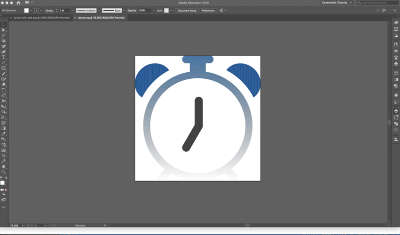

# SVG Converter

`convert-svg-react`:
Javascript module that allows you to use inline svg's in your ReactJS projects. Converts all the attributes and elements to proper JSX.

#### WHY?
Was started because I wanted to use inline SVG as XML with ReactJS, but when ReactJS complains of all the attributes that need to be changed like `className` and inline styling it gets difficult to remember everything that needs to be changed. This will do it all for you.

- You can take your `Adobe Ai` svg file and paste it, or even link your .svg file. Will output new svg xml markup to be copied into your React project. This works with CommonJS / NodeJS or client side with ReactJS.

## Installation <convert-svg-react>

Use with [npm](http://npmjs.com):

```
npm install --save convert-svg-react
```


## Usage Example Client (ReactJS):
### &nbsp; From string easiest and fastest:
&nbsp;* Used backticks `` to wrap the string else string has to be in one single line wraped with quotes

```js   
import React from 'react';
import ReactDOM from 'react-dom';
import Convert from 'convert-svg-react'


const svgString = `
<svg width="1em" height="1em" viewBox="0 0 16 16" class="bi bi-caret-right-square-fill" fill="currentColor" xmlns="http://www.w3.org/2000/svg"> 
<path fill-rule="evenodd" d="M0 2a2 2 0 0 1 2-2h12a2 2 0 0 1 2 2v12a2 2 0 0 1-2 2H2a2 2 0 0 1-2-2V2zm5.5 10a.5.5 0 0 0 .832.374l4.5-4a.5.5 
0 0 0 0-.748l-4.5-4A.5.5 0 0 0 5.5 4v8z"/>
</svg>
`

function App(props) {
    return (
        <>
            <Convert string={svgString}/>
        </>
    );
}

ReactDOM.render(
    <App />,
    document.getElementById('app')
);
```

## Usage Example Client (ReactJS):
### &nbsp;From external file - path:
&nbsp;* Returns a promise

- FIRST Make sure to have a file loader like [file-loader](https://www.npmjs.com/package/file-loader) or [url-loader](https://www.npmjs.com/package/url-loader) in your ReactJS project, and set up your limit to a large file in `webpack.config.js` :

```js
    {
        test: /\.(png|jpg|gif|svg)$/i,
        use: [
            {
                loader: 'url-loader',
                options: {
                    limit: 100000,
                },
            },
        ]
    }
```

```js

import svgFile from '../public/alarm-gradient.svg'
import convert from 'convert-svg-react'

function App(props) {
    const [svg, setSvg] = useState('')

    useEffect(()=> {
        // Returns a promise
        convert(svgFile).then(svg => setSvg(svg))
    },[])

    return (
        <>      
            {/* Will display your converted code for copying as well as your svg */}
            {svg && svg}
        </>
    );
}

ReactDOM.render(
    <App />,
    document.getElementById('app')
);
```

### Renders as such:

    * Your actual svg converted
    * Converted svg / xml to be copied for React


### Live example from svg file:



## Usage CommonJS (NodeJS)
### &nbsp; From external file:

```js
const convert = require('convert-svg-react');
convert('./path/tosvg/file.svg');
```

### &nbsp; From string file:

```javascript
const convert = require('convert-svg-react');
convert(`<svg width="1em" height="1em" viewBox="0 0 16 16" class="bi bi-caret-right-square-fill" fill="currentColor" xmlns="http://www.w3.org/2000/svg">
  <path fill-rule="evenodd" d="M0 2a2 2 0 0 1 2-2h12a2 2 0 0 1 2 2v12a2 2 0 0 1-2 2H2a2 2 0 0 1-2-2V2zm5.5 10a.5.5 0 0 0 .832.374l4.5-4a.5.5 0 0 0 0-.748l-4.5-4A.5.5 0 0 0 5.5 4v8z"/>
</svg>`);
```

### Converted: 
* After the file path arguement is given and everything goes well you will receieve output in the terminal:
 `Open browswer http://localhost:8002/` 

  * Open browser ` http://localhost:8002/ `
  * Properly indented
  * Attributes changed for JSX
  * Elements on their own lines 
  * Converted inline style to jsx insline styling
  * Inline CSS Style element interpolation: `{<Style ....>}`

```xml
<div className="alarm-robot">
    <svg xmlns="http://www.w3.org/2000/svg" x="0px" y="0px"
    viewBox="0 0 551.1 551.2" xmlSpace="preserve">
        <style type="text/css">{
            ".st0{fill:#176096;}"+
            ".st1{fill:url(#body_1_);}"+
            ".st2{stroke:#000000;stroke-width:34;stroke-linecap:round;stroke-miterlimit:10;}"
        }</style>
        <path id="left-ring" className="st0" d="M150.2,64.6C99.2,91,57.6,132.9,31.6,184.1c-4.9-3.4-9.4-7.4-13.5-12
        c-28.4-32.5-22.7-84,12.7-115c35.4-31,87.2-29.7,115.6,2.8C147.8,61.4,149,63,150.2,64.6z"/>
        <path id="right-ring" className="st0" d="M533,172.1c-3.9,4.5-8.2,8.3-12.9,11.6c-26.1-51.2-67.9-93.1-119-119.4c1.1-1.5,2.3-3,3.5-4.4
        c28.4-32.5,80.2-33.7,115.6-2.8C555.8,88.1,561.5,139.6,533,172.1z"/>
        <linearGradient id="body_1_" gradientUnits="userSpaceOnUse" x1="275.9758" y1="551.1533" x2="275.9758" y2="-9.094947e-13">
            <stop  offset="0" style={{stopColor:"#000000",stopOpacity:"0",}}/>
            <stop  offset="1" style={{stopColor:"#176096",stopOpacity:"0.8567",}}/>
        </linearGradient>
        <path id="body" className="st1" d="M421.8,497.5c56.7-43.7,93.2-112.3,93.2-189.4c0-120.2-88.8-219.7-204.3-236.5V33.8h16.8
        c9.3,0,16.9-7.6,16.9-16.9v0c0-9.3-7.6-16.9-16.9-16.9H224.6c-9.3,0-16.9,7.6-16.9,16.9v0c0,9.3,7.6,16.9,16.9,16.9h16.8v37.8
        C125.7,88.4,37,187.8,37,308.1c0,77.5,36.9,146.4,94.1,190.1L106.2,523c-6.4,6.4-6.4,16.9,0,23.3c3.2,3.2,7.5,4.8,11.7,4.8
        c4.2,0,8.4-1.6,11.7-4.8l29.7-29.7c34.5,19.4,74.4,30.4,116.8,30.4c42.8,0,83-11.2,117.7-31l30.2,30.2c3.2,3.2,7.4,4.8,11.7,4.8
        c4.2,0,8.4-1.6,11.7-4.8c6.4-6.5,6.4-16.9,0-23.3L421.8,497.5z M386.3,485.4c-4.8,3-9.8,5.8-14.9,8.5c-28.6,14.7-61.1,23-95.5,23
        c-34,0-66.1-8.1-94.5-22.5c-5.1-2.6-10.1-5.4-14.9-8.4c-4.8-2.9-9.4-6.1-13.9-9.4c-51.8-38-85.5-99.3-85.5-168.5
        c0-115.3,93.5-208.8,208.8-208.8s208.8,93.5,208.8,208.8c0,68.8-33.3,129.8-84.6,167.8C395.7,479.3,391.1,482.4,386.3,485.4z"/>
        <g id="hands">
            <line className="st2" x1="280" y1="308.5" x2="280" y2="198.3"/>
            <line className="st2" x1="280" y1="308.5" x2="224.8" y2="403.8"/>
        </g>
    </svg>
</div>
```

## Actual file output CommonJS (NodeJS):


